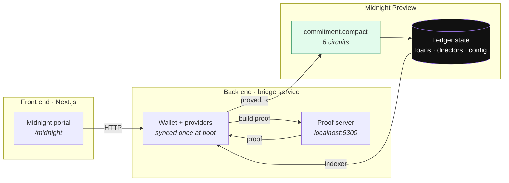

# VERITY

**A board vote that proves itself.**

Supervisory infrastructure for bank loan classification, built on **Midnight**. The rules a
regulator already writes are enforced inside a Compact smart contract, and the evidence that
a board actually authorised a write-off is proved in **zero knowledge** — the directors'
credentials never reach the chain.

*Brainwave 2026 · Midnight Track · Team Logarithm*

> **Live on Midnight Preview.**
> Contract address: `6fcd40645315980824c02a865e9601b206a3d0702ecf4ea8044a9fd950d67a2b`
>
> Verified end to end: the same write-off transaction was **refused** with zero director
> approvals and **committed at block 580673** with two — and the approving credentials
> never appeared on the ledger. Reproduce it with `node scripts/midnight-smoke.mjs`.

---

## The problem

A supervisor's rules are usually not what is missing.

Classification already has to be justified in writing over two named signatures.
Rescheduling is already capped at a fixed number of occasions. The later attempts already
need Board approval. Those rules exist, and they are specific.

**What is missing is the record.** It is held by the institution being examined. It can be
revised afterwards. And it is read once a year, when an inspector is physically present.

The gap this creates is not theoretical. One Asset Quality Review of six banks assessed
roughly **4.2×** the non-performing loans those banks had reported.

### Why not just put it on a blockchain?

Because the obvious version of that trade is bad. A bank's board approving a write-off is
commercially sensitive information. Proving you had board authorisation by **publishing
every director's signature** hands a competitor your governance record. That is a real
reason institutions resist transparent ledgers, and it is not an unreasonable one.

Verity's claim is that you should not have to choose. A supervisor needs to know that
*enough of the right people* approved. It does not need to know *who they were and what
they signed*.

---

## What Midnight changes

The predecessor of this project ran on Hyperledger Fabric. Porting to Midnight was not a
change of hosting — it changed what the contract can honestly claim.

| | Fabric version | Midnight version |
|---|---|---|
| Board approval evidence | every director signature submitted **in cleartext** as a transaction argument | approval secrets are a **private witness**; only the count that verified is disclosed |
| Regulatory thresholds | hardcoded, with jurisdiction-specific citations | `RegulatoryConfig` ledger struct, Council-governed, changeable without redeploying |
| Who may confirm a director | MSP identity | on-ledger role registry; a bank still cannot constitute its own board |

### The board-threshold circuit

This is the heart of the project.

A director registers a **commitment** to a secret, not the secret:
`publicKeyCommitment = persistentHash([secret])`. To approve an event, they supply that
secret privately. Inside the circuit, Verity:

1. re-derives `persistentHash([secret])` and compares it to the registered commitment;
2. counts the slot only if that director is **confirmed** and **not revoked**;
3. rejects duplicates pairwise, so one director cannot fill several slots;
4. discloses **only the resulting count** — never the secrets.

```
assert(disclose(validCount) >= config.boardThresholdK,
       "board authorisation required: insufficient confirmed director signatures")
```

A verifier learns *"enough directors approved."* Nothing else crosses the boundary.

### What this does and does not prove

We would rather write the limits down than let a demo imply more than it delivers.

- It **does** prove knowledge of the preimage of a registered commitment, so a director's
  credential never appears on-chain. That is a real improvement over the Fabric version.
- It is **not** a signature over the event. A bank that has collected a director's secret
  once could reuse it for a later vote without asking again. Binding an approval to a
  specific event needs a per-event registration step this registry does not model yet.
- Director **identities are still disclosed**, because looking a director up in a public
  ledger `Map` requires a public key. What the ZK layer buys here is **credential secrecy,
  not voter anonymity**.

---

## Architecture



The bridge is a **separate long-lived process**, and that is a structural decision rather
than a stylistic one: a Midnight wallet must replay ledger history before it can sign
anything, which takes minutes. It cannot be constructed per request. It syncs once at boot,
caches its synced state to disk, and then serves circuit calls.

### The contract

`midnight/contracts/commitment/src/commitment.compact` — 6 circuits:

| Circuit | Authority required |
|---|---|
| `originateLoan` | a bank (`BANK_A` / `BANK_B`) |
| `appendEvent` | the institution that owns the loan, plus the event's own authority rule |
| `registerDirector` | the bank itself — `role == institution` |
| `confirmDirector` | Central Authority only — a bank cannot constitute its own board |
| `revokeDirector` | Central Authority or the bank |
| `setRegulatoryConfig` | a Regulatory Council member |

`appendEvent` runs a decision table: a write-off, a third-or-later reschedule, and an
upgrade out of a classified tier all escalate to `BOARD_THRESHOLD`. Everything else needs
either one level above the sanctioning officer, MD/CEO authority, or nothing beyond the
arithmetic.

---

## Run it

Requires **Docker**, **Node 20+**, and — to compile the contract — **WSL2** on Windows,
since the Compact toolchain has no native Windows build.

### 1. Compile the contract

```bash
# inside WSL
curl --proto '=https' --tlsv1.2 -LsSf \
  https://github.com/midnightntwrk/compact/releases/latest/download/compact-installer.sh | sh
compact update 0.31.1          # pin: 0.34.0 speaks language 0.26 and rejects this contract

cd midnight/contracts/commitment
npm install
npm run compact
```

> If `compact update` fails with *"Failed to spawn artifact extraction command"*, it is
> shelling out to `unzip`, which some WSL images lack. Install it, or see
> [the contract README](midnight/contracts/commitment/README.md) for a no-sudo workaround.

### 2. Start the proof server

```bash
docker run -d -p 6300:6300 midnightntwrk/proof-server:8.1.0 midnight-proof-server -v
```

### 3. Deploy to Midnight Preview

Run the deploy with no seed and it will generate one, print its address, and wait:

```bash
cd midnight/contracts/commitment
MIDNIGHT_NETWORK=preview NODE_OPTIONS=--max-old-space-size=6144 npx tsx src/deploy.ts
```

Fund the printed address at **https://faucet.preview.midnight.network/**. The faucet is
captcha-gated, so this step needs a browser — it cannot be scripted. The deploy resumes on
its own and writes `deployment.preview.json`.

> **The first sync takes tens of minutes** — it replays the whole ledger. The heartbeat
> line reports progress; a climbing `dust=` number means it is working, not hung. After it
> finishes, the wallet state is cached and every later start takes **seconds**.

### 4. Start the bridge and the front end

```bash
# terminal 1
cd midnight/contracts/commitment
MIDNIGHT_NETWORK=preview MIDNIGHT_WALLET_SEED=<seed> npm run bridge

# terminal 2  (repo root)
npm install
npm --prefix web run dev
```

Open <http://localhost:3000/midnight>.

### 5. Verify it without clicking anything

```bash
node scripts/midnight-smoke.mjs
```

This drives the whole story over HTTP and **fails loudly if the write-off commits without
board approval**. A run where that succeeds is a failure even though nothing threw — it
would mean the threshold is not being enforced, which is the entire claim.

Actual output against the live contract:

```
4. Attempt WRITE_OFF with 0 of 2 approvals (must be refused)
   refused        board authorisation required: insufficient confirmed director signatures

5. Resubmit with 2 approvals (must commit)
   committed      00ccba624d4324ccc248423315fe101df617c5d951d41b1f07c4da710df8531623
   block          580673

PASSED — the same submission was refused without board approval and
committed with it, and the approving credentials never reached the ledger.
```

---

## The demonstration

The `/midnight` page walks one story, and the interesting step is a refusal:

1. **Set the rule.** Board threshold and reschedule cap are Council-governed ledger state,
   not constants baked into the contract.
2. **Constitute a board.** A director registers a commitment; only the Central Authority
   can confirm them. Note this needs two different parties — the contract refuses a bank
   that tries to confirm its own directors.
3. **Originate a loan.**
4. **Attempt a write-off with too few approvals.** The circuit refuses. The refusal comes
   from the proof, not from the page — there is no front-end check to bypass.
5. **Submit it again with enough approvals.** It commits, with a receipt naming the
   network, contract, and block.

See [DEMO.md](DEMO.md) for the full runbook.

---

## Engineering notes

Four problems in this build were expensive enough to be worth recording. Full detail lives
in [the contract README](midnight/contracts/commitment/README.md).

**Wallet sync throughput.** A first-time sync replays every ledger event. The SDK's default
batching walked the shielded stream at ~80 events/s — about five hours — and exhausted a
6GB heap before finishing. The shielded wallet's config accepts a `batchSize`; at 5,000 the
same scan runs at **~14,000 events/s with resident memory flat near 340MB**. That one
number is the difference between "cannot sync at all" and "syncs in two minutes."

**Preview vs PreProd.** The DUST wallet's batch size is **hardcoded at 10 events/tick**
inside the SDK, so it cannot be tuned and runs at 60–280 events/s regardless:

| Network | Stream length | First sync |
|---|---|---|
| Preview | ~151,000 events | tens of minutes — workable |
| PreProd | ~1,453,000 events | over nine hours, and it exhausts memory first |

Preview is therefore the default. The competition rules accept either.

**Duplicate wasm instances.** Two installs of `@midnight-ntwrk/onchain-runtime-v3` — even
at the *same version* — mean two wasm instantiations, and `instanceof` fails across them.
The symptom is a bare `expected instance of StateValue` from deep inside a transaction
merge. It needs one *hoisted* copy, not merely one version.

**Windows file URLs.** `new URL(import.meta.url).pathname` keeps a leading slash on
Windows, so `path.resolve` produces `G:\G:\…`. Everything derived from it silently pointed
at a directory that does not exist, and the deploy failed *after* half an hour of syncing
with an error about a missing verifier key that was sitting right there on disk. Use
`fileURLToPath`. A `preflight()` check now catches this class of bug in two seconds.

---

## What is built, and what is not

**Built and verified against the live contract**
- `commitment.compact` — 6 circuits, real k-of-n board threshold proved in zero knowledge
- Wallet / provider / deploy layer, with state caching so restarts are fast
- Bridge service and Midnight portal, exercised end to end by the smoke test

**Honest gaps**
- The `ONE_LEVEL_ABOVE` seniority check is still a placeholder (`assert(true, …)`).
- Board approvals are replayable across events (see above).
- The bridge asserts its own `callerRole` per endpoint. That is fine for a prototype where
  one operator drives every party, but it is **not a security boundary** — production would
  derive the role from the caller's own key.
- Only the `commitment` module exists on Midnight. Two further modules were designed but
  are **not** built here: `exposure` (cross-bank encrypted exposure aggregation) and
  `claims` (depositor claim tokens). They are described in the whitepaper, not implemented.
- A predecessor of this project ran on Hyperledger Fabric. That stack has been removed —
  this repository is the Midnight build and nothing else. The Fabric code remains in git
  history at commit `79eeef7` for anyone who wants to compare the two approaches.

All data is synthetic. No real borrower, depositor, or institution appears anywhere, and
institution names are placeholders.

---

## Repository map

```
midnight/contracts/commitment/
  src/commitment.compact     the smart contract — 6 circuits
  src/api.ts                 wallet, providers, deploy/join, circuit calls
  src/deploy.ts              deploy CLI -> deployment.<network>.json
  src/bridge.ts              the back end
  src/preflight.ts           fail-fast checks before the long sync
  src/witnesses.ts           private witnesses (callerRole, board approvals)
  README.md                  build status, toolchain gotchas, threshold scope
midnight/reference/          upstream example-counter source, kept for comparison
web/app/page.tsx             landing
web/app/midnight/page.tsx    the Midnight portal
web/lib/midnight.ts          bridge client
scripts/midnight-smoke.mjs   end-to-end verification
```

## Licence

MIT — see [LICENSE](LICENSE).
