<div align="center">

# QUORUM

### A board vote that proves itself.

**Supervisory infrastructure for bank loan classification, built on [Midnight](https://midnight.network/).**

A regulator's authority rules run inside a Compact smart contract, and the evidence that a board actually
authorised a write-off is proved in **zero knowledge** — the directors' credentials never reach the chain.

*Brainwave 2026 · Midnight Track · Team Logarithm*

<br>

<a href="https://youtu.be/CMZEeINqj_Y">
  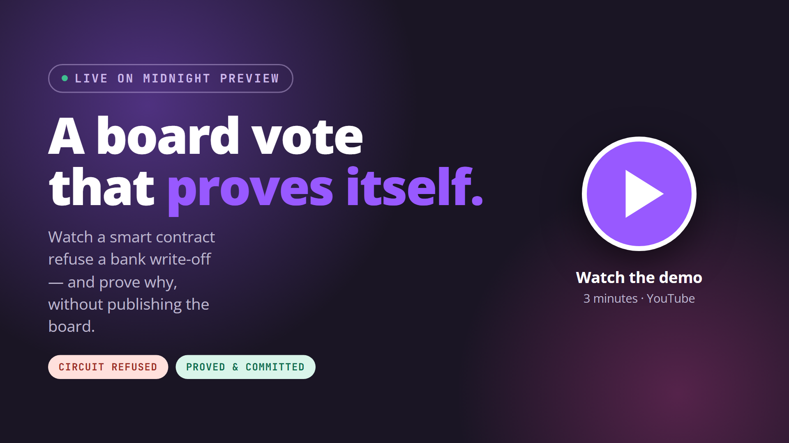
</a>

<br><br>

### Read these too

<table>
<tr>
<td align="center" width="34%">
  <a href="https://drive.google.com/file/d/1wgVCV2mz8iZhXRm5dpX8YeA0t28jqTwH/view?usp=sharing">
  <b>WHITEPAPER&nbsp;(PDF)</b></a>
  <br><br>
  <sub>10 pages. The problem, both<br>zero-knowledge circuits, the<br>deployment, and the limits.</sub>
</td>
<td align="center" width="33%">
  <a href="https://docs.google.com/presentation/d/1bE153LTVhCv--GqphFpmCYK1hnEkhFdk/edit?usp=sharing&ouid=101782489806446060113&rtpof=true&sd=true">
  <b>PITCH&nbsp;DECK</b></a>
  <br><br>
  <sub>8 slides. The pitch in the<br>order it is told in the video.</sub>
</td>
<td align="center" width="33%">
  <a href="https://youtu.be/CMZEeINqj_Y"><b>DEMO&nbsp;VIDEO</b></a>
  <br><br>
  <sub>3 minutes. Watch the contract<br>refuse a write-off, then accept it.</sub>
</td>
</tr>
</table>

</div>

> ### Live on Midnight Preview
>
> **Contract** `08b5b8b1bb403524b1066615752512019714a64859f77bea868f8615fe0f51da`
>
> Verified end to end, twice over. The same **write-off** was refused with too few director approvals and
> committed with enough. The same **restructure** was refused at the grade that sanctioned the loan and
> committed one grade above it. Neither the director secrets nor the officer's grade ever reached the ledger.
>
> Reproduce both with `node scripts/midnight-smoke.mjs`.

---

## The problem

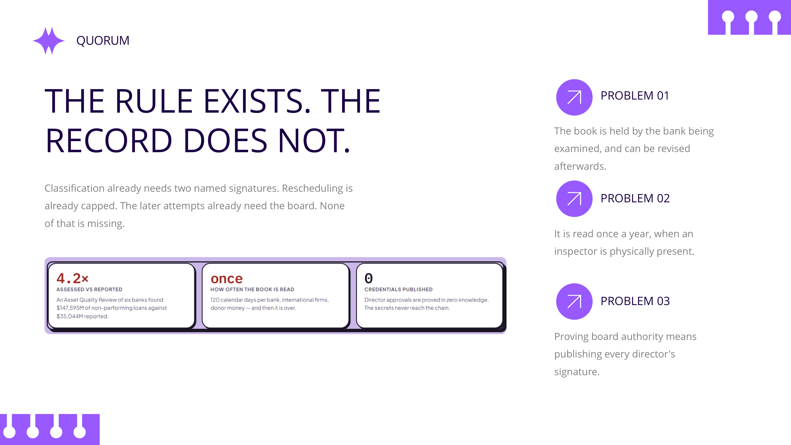

Big companies and well-connected borrowers take large bank loans and never pay them back. The loss is then
hidden rather than recognised: instead of marking the loan as bad, the bank keeps granting a new repayment
deadline, or quietly writes it off. On paper the book looks healthy.

**The rules against this already exist.** Classification must be justified in writing over two named
signatures. Rescheduling is capped and escalates to the board. A write-off needs board authorisation.

**What is missing is the record.** It is held by the bank being examined, it can be revised afterwards, and
it is read once a year when an inspector is physically present. One Asset Quality Review of six banks
assessed roughly **4.2×** the non-performing loans those banks had reported.

### Why not just put it on a blockchain?

Because the obvious version of that trade is bad. A bank's board approving a write-off is commercially
sensitive. Proving you had board authorisation by **publishing every director's signature** hands a
competitor your governance record. That is a real reason institutions resist transparent ledgers, and it is
not an unreasonable one.

---

## What Quorum does

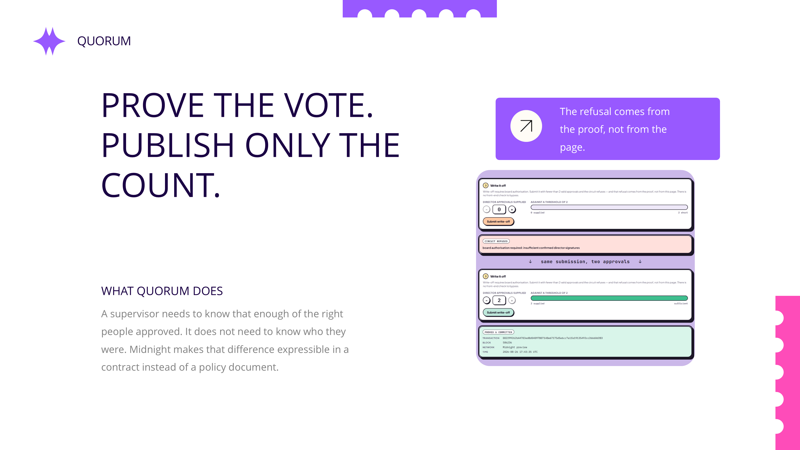

**Quorum's claim is that you should not have to choose.** A supervisor needs to know that *enough of the
right people* approved. It does not need to know *who they were*.

Those are two different questions, and only one of them requires anyone to publish anything. Midnight is
what makes the distinction expressible in a contract rather than a policy document.

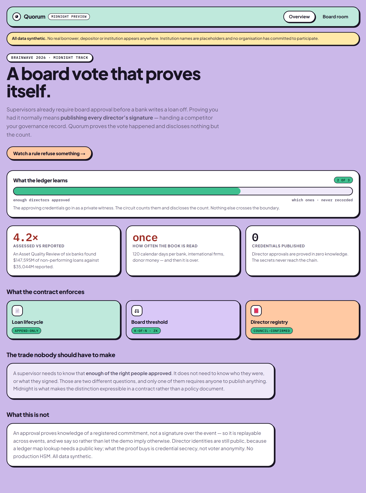

---

## How it works

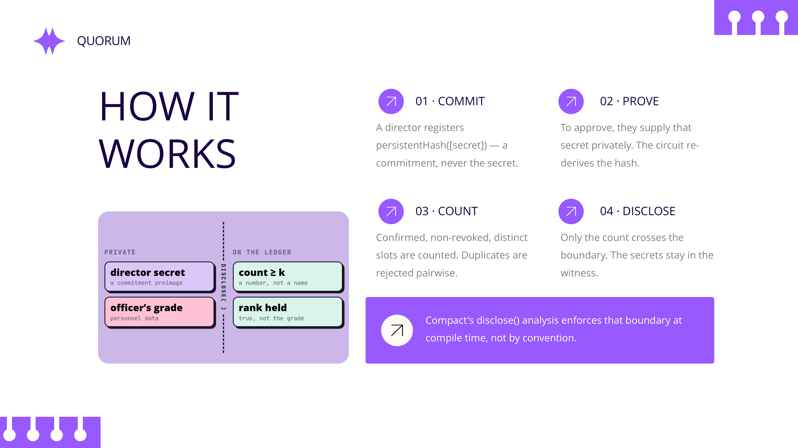

Two authority rules are proved in zero knowledge, with **different privacy shapes** — a count over a set,
and a single comparison. One ZK rule can look like a party trick; two show the pattern generalises.

### 1 · The board threshold — *k*-of-*n* over private secrets

A director registers a **commitment to a secret**, never the secret:

```
publicKeyCommitment = persistentHash([secret])
```

To approve an event they supply that secret **privately**. Inside the circuit, Quorum:

1. re-derives `persistentHash([secret])` and compares it to the registered commitment;
2. counts the slot only if that director is **confirmed** and **not revoked**;
3. rejects duplicates pairwise, so one director cannot fill several slots;
4. discloses **only the resulting count** — never the secrets.

```ts
assert(disclose(validCount) >= config.boardThresholdK,
       "board authorisation required: insufficient confirmed director signatures")
```

A verifier learns *"enough directors approved."* Nothing else crosses the boundary.

### 2 · Seniority — a private grade against a public bar

A restructure does not need the board, but it does need **rank**: it must be authorised at least one grade
above the officer who sanctioned the loan, so nobody clears their own decision.

```ts
const actingGrade = callerSeniority();          // private witness
assert(disclose(actingGrade > sanctioningSeniority),
       "authority required: this event must be authorised at least one grade
        above the sanctioning officer")
```

An officer's grade is personnel data — publishing it on every reclassification would leak the bank's whole
internal hierarchy. The ledger records that the rule **held**, not who held it. The loan's *sanctioning*
grade stays public, because it is the bar a later event must clear and a bar nobody can read is not a bar.

### The boundary is enforced by the compiler

Compact's `disclose()` analysis is what makes this checkable rather than conventional: a witness value
becomes public ledger state only when explicitly wrapped, and the contract does not compile otherwise.

---

## Watch a rule refuse something

The demonstration is one specific refusal — and the interesting part is that **it does not come from the
page**.

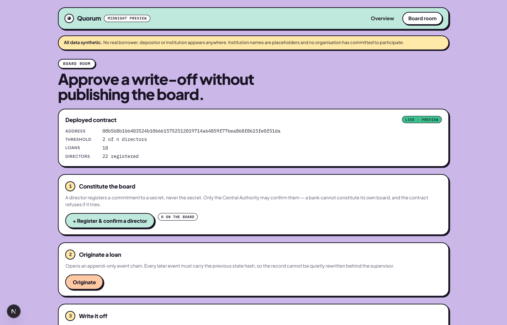

**1 · Constitute a board.** A bank registers its directors, but only the Central Authority can confirm them.
A bank that could seat its own board could approve its own write-offs, so the contract refuses it.

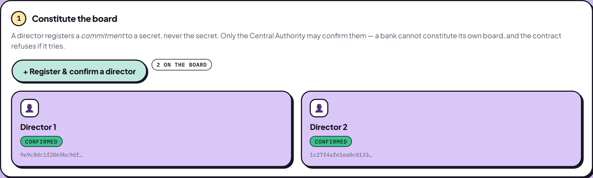

**2 · Submit a write-off with too few approvals.**

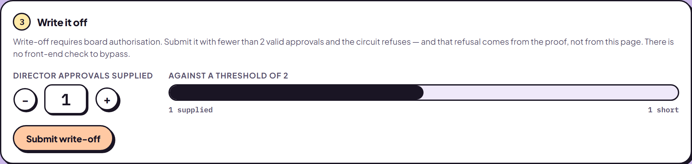

**3 · The circuit refuses.** The page happily sent it. The refusal came from the *proof* — the circuit
counted the valid director approvals, came up short of the threshold, and the transaction could not be
constructed. There is no front-end check to bypass.

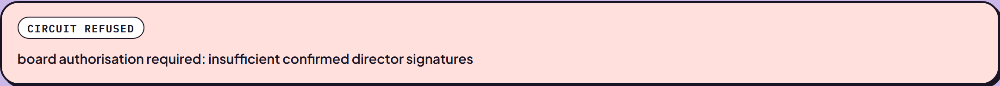

**4 · Same loan, same circuit, enough approvals.** It commits, with a receipt naming the network, contract
and block.

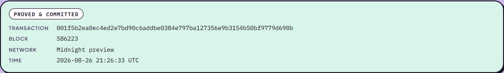

**5 · The second rule.** A restructure submitted at the sanctioning grade is refused; one grade above, it
commits — and that grade was never published either.

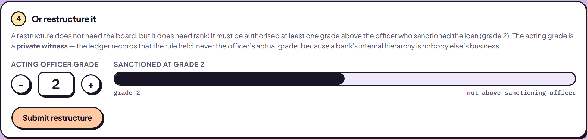

<div align="center">

<a href="https://youtu.be/CMZEeINqj_Y">
  
</a>

**All five steps, narrated, in three minutes.**

</div>

---

## Deployed on Midnight Preview

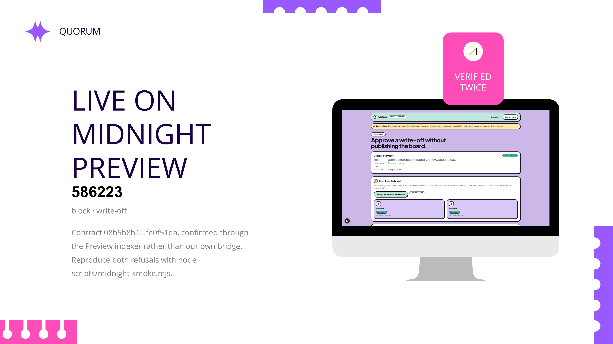

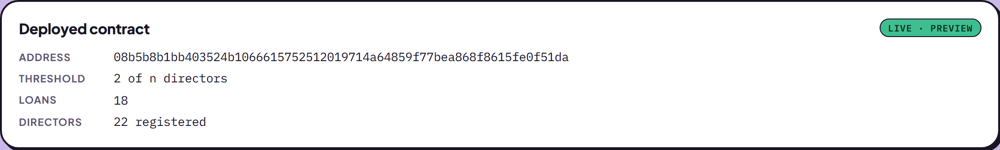

The contract address above is live on Midnight Preview and confirmed through the **Preview indexer**, not
just through our own bridge. Board threshold and reschedule cap are not constants compiled in — they are
`RegulatoryConfig` ledger state a Regulatory Council governs, and the bank cannot touch them.

### Verify it without clicking anything

```bash
node scripts/midnight-smoke.mjs
```

This drives the whole story over HTTP and **fails loudly if the write-off commits without board approval**.
A run where that succeeds is a failure even though nothing threw — it would mean the threshold is not being
enforced, which is the entire claim.

Actual output against the live contract:

```
4. Attempt WRITE_OFF with 0 of 2 approvals (must be refused)
   refused        board authorisation required: insufficient confirmed director signatures

5. Resubmit with 2 approvals (must commit)
   committed      001f5b2ea0ec4ed2e7bd90c6addbe0384e797ba127356e9b3154b50bf9779d690b
   block          586223

6. RESTRUCTURE at the sanctioning grade (must be refused)
   loan sanctioned at grade 2
   refused        authority required: this event must be authorised at least one grade
                  above the sanctioning officer

7. Resubmit one grade above (must commit)
   committed      002299262b44783ed8d04097807148e67175d5e6cc7a1fe19135493cc26660d283
   block          586236

PASSED
  · the same write-off was refused without board approval, committed with it
  · the same restructure was refused at the sanctioning grade, committed above it
  · neither the director secrets nor the officer's grade reached the ledger
```

---

## Architecture

Full stack: a Next.js front end, a long-lived bridge service holding the wallet and providers, and a Compact
contract on Midnight Preview.

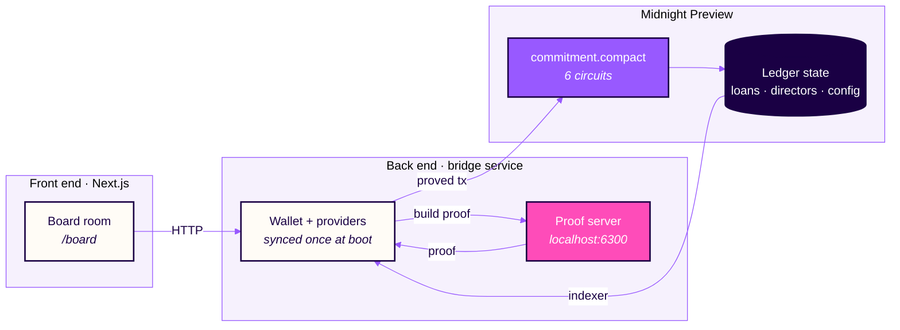

The bridge is a **separate long-lived process**, and that is a structural decision rather than a stylistic
one: a Midnight wallet must replay ledger history before it can sign anything, which takes minutes. It cannot
be constructed per request. It syncs once at boot, caches its synced state to disk, and then serves circuit
calls.

### The contract — `midnight/contracts/commitment/src/commitment.compact`

| Circuit | Authority required |
|---|---|
| `originateLoan` | a bank (`BANK_A` / `BANK_B`) |
| `appendEvent` | the institution that owns the loan, plus the event's own authority rule |
| `registerDirector` | the bank itself — `role == institution` |
| `confirmDirector` | Central Authority only — a bank cannot constitute its own board |
| `revokeDirector` | Central Authority or the bank |
| `setRegulatoryConfig` | a Regulatory Council member |

`appendEvent` runs a decision table. A write-off, a third-or-later reschedule, and an upgrade out of a
classified tier all escalate to `BOARD_THRESHOLD`. Everything else needs either one grade above the
sanctioning officer, MD/CEO authority, or nothing beyond the arithmetic.

---

## Run it

Requires **Docker**, **Node 20+**, and — to compile the contract — **WSL2** on Windows, since the Compact
toolchain has no native Windows build.

### 1. Compile the contract

```bash
# inside WSL
curl --proto '=https' --tlsv1.2 -LsSf \
  https://github.com/midnightntwrk/compact/releases/latest/download/compact-installer.sh | sh
compact update 0.31.1          # pin: 0.34.0 speaks language 0.26 and rejects this contract

cd midnight/contracts/commitment
npm install
npm run compact
```

> If `compact update` fails with *"Failed to spawn artifact extraction command"*, it is shelling out to
> `unzip`, which some WSL images lack. Install it, or see
> [the contract README](midnight/contracts/commitment/README.md) for a no-sudo workaround.

### 2. Start the proof server

```bash
docker run -d -p 6300:6300 midnightntwrk/proof-server:8.1.0 midnight-proof-server -v
```

### 3. Deploy to Midnight Preview

Run the deploy with no seed and it will generate one, print its address, and wait:

```bash
cd midnight/contracts/commitment
MIDNIGHT_NETWORK=preview NODE_OPTIONS=--max-old-space-size=6144 npx tsx src/deploy.ts
```

Fund the printed address at **https://faucet.preview.midnight.network/**. The faucet is captcha-gated, so
this step needs a browser — it cannot be scripted. The deploy resumes on its own and writes
`deployment.preview.json`.

> **The first sync takes tens of minutes** — it replays the whole ledger. The heartbeat line reports
> progress; a climbing `dust=` number means it is working, not hung. After it finishes, the wallet state is
> cached and every later start takes **seconds**.

### 4. Start the bridge and the front end

```bash
# terminal 1
cd midnight/contracts/commitment
MIDNIGHT_NETWORK=preview MIDNIGHT_WALLET_SEED=<seed> npm run bridge

# terminal 2  (repo root)
npm install
npm --prefix web run dev
```

Open <http://localhost:3000/board>.

---

## Engineering notes

Four problems in this build were expensive enough to be worth recording. Full detail lives in
[the contract README](midnight/contracts/commitment/README.md) and in the
[whitepaper](whitePaper/Quorum_whitepaper.pdf).

**Wallet sync throughput.** A first-time sync replays every ledger event. The SDK's default batching walked
the shielded stream at ~80 events/s — about five hours — and exhausted a 6GB heap before finishing. The
shielded wallet's config accepts a `batchSize`; at 5,000 the same scan runs at **~14,000 events/s with
resident memory flat near 340MB**. That one number is the difference between "cannot sync at all" and
"syncs in two minutes."

**Preview vs PreProd.** The DUST wallet's batch size is **hardcoded at 10 events/tick** inside the SDK, so
it cannot be tuned and runs at 60–280 events/s regardless.

| Network | Stream length | First sync |
|---|---|---|
| Preview | ~151,000 events | tens of minutes — workable |
| PreProd | ~1,453,000 events | over nine hours, and it exhausts memory first |

Preview is therefore the default. The competition rules accept either.

**Duplicate wasm instances.** Two installs of `@midnight-ntwrk/onchain-runtime-v3` — even at the *same
version* — mean two wasm instantiations, and `instanceof` fails across them. The symptom is a bare
`expected instance of StateValue` from deep inside a transaction merge. It needs one *hoisted* copy, not
merely one version.

**Windows file URLs.** `new URL(import.meta.url).pathname` keeps a leading slash on Windows, so
`path.resolve` produces `G:\G:\…`. Everything derived from it silently pointed at a directory that does not
exist, and the deploy failed *after* half an hour of syncing with an error about a missing verifier key that
was sitting right there on disk. Use `fileURLToPath`. A `preflight()` check now catches this class of bug in
two seconds.

---

## What is built, and what is not

**Built and verified against the live contract**

- `commitment.compact` — 6 circuits, a real *k*-of-*n* board threshold proved in zero knowledge, and a
  seniority rule proved over a private grade
- Wallet / provider / deploy layer, with state caching so restarts are fast
- Bridge service and Next.js board room, exercised end to end by the smoke test

**Honest gaps** — we would rather write these down than let a demo imply more than it delivers.

1. **Board approvals are replayable across events.** An approval proves knowledge of the preimage of a
   registered commitment. It is *not* a signature over the event, so a bank holding a director's secret
   could reuse it for a later vote. Binding an approval to a specific event needs a per-event registration
   step this registry does not model yet.
2. **Director identities are still disclosed**, because looking a director up in a public ledger `Map`
   requires a public key. What the ZK layer buys here is **credential secrecy, not voter anonymity**.
3. **The bridge asserts its own `callerRole` per endpoint.** Fine for a prototype where one operator drives
   every party, but it is **not a security boundary** — production would derive the role from the caller's
   own key.
4. **Only the `commitment` module exists on Midnight.** Two further modules were designed but are not built
   here: cross-bank encrypted exposure aggregation, and depositor claim tokens. They are described in the
   whitepaper as future work, not as delivered features.
5. **It can record a falsehood.** If the core banking data is manipulated upstream, Quorum commits it with
   valid proofs. The defence is attribution and reconciliation, and neither prevents coordinated internal
   falsification.

A predecessor of this project ran on Hyperledger Fabric, where director signatures went in as **cleartext
transaction arguments**. That stack has been removed — this repository is the Midnight build and nothing
else. The Fabric code remains in git history at commit `79eeef7` for anyone who wants to compare.

**All data is synthetic.** No real borrower, depositor, or institution appears anywhere, and institution
names are placeholders.

---

## Roadmap

| | Scope | Depends on |
|---|---|---|
| **Now** | Six circuits on Preview; board threshold and seniority proved in ZK; bridge and board room | delivered |
| **Next** | Bind approvals to a specific event hash; derive `callerRole` from the caller's key | contract work only |
| **Then** | Cross-institution exposure aggregation under encryption — a borrower group's system-wide total without any bank exposing its book | more than one participating institution |
| **Later** | Depositor claim tokens bound to signed balance leaves | resolution-law authorisation |

The first two rows need no other participant. That sequencing is deliberate: a supervisory network that must
be complete before it is useful is a network that never starts.

---

## Repository map

```
midnight/contracts/commitment/
  src/commitment.compact     the smart contract — 6 circuits
  src/api.ts                 wallet, providers, deploy/join, circuit calls
  src/deploy.ts              deploy CLI -> deployment.<network>.json
  src/bridge.ts              the back end
  src/preflight.ts           fail-fast checks before the long sync
  src/witnesses.ts           private witnesses (callerRole, board approvals)
  README.md                  build status, toolchain gotchas, threshold scope
web/app/page.tsx             overview
web/app/board/page.tsx       the board room — the demo
web/lib/midnight.ts          bridge client
scripts/midnight-smoke.mjs   end-to-end verification
whitePaper/                  Quorum whitepaper — Markdown, LaTeX source and PDF
slides/                      pitch deck (.pptx) and slide exports
```

---

## Team

**Team Logarithm**

| Member | Responsibility |
|---|---|
| **Oitijya Islam Auvro** | Contract design, zero-knowledge circuits, wallet and provider layer |
| **Md. Nafiz Ahmed** | Bridge service, deployment to Midnight Preview, end-to-end verification |
| **Dewan Salman Rahman Zisan** | Front end, banking-regulation research, documentation |

---

## Licence

MIT — see [LICENSE](LICENSE).

---

<div align="center">

### Before you go

<table>
<tr>
<td align="center" width="34%">
  <a href="https://drive.google.com/file/d/1wgVCV2mz8iZhXRm5dpX8YeA0t28jqTwH/view?usp=sharing">
  <b>WHITEPAPER&nbsp;(PDF)</b></a>
</td>
<td align="center" width="33%">
  <a href="https://docs.google.com/presentation/d/1bE153LTVhCv--GqphFpmCYK1hnEkhFdk/edit?usp=sharing&ouid=101782489806446060113&rtpof=true&sd=true">
  <b>PITCH&nbsp;DECK</b></a>
</td>
<td align="center" width="33%">
  <a href="https://youtu.be/CMZEeINqj_Y"><b>DEMO&nbsp;VIDEO</b></a>
</td>
</tr>
</table>

<br>

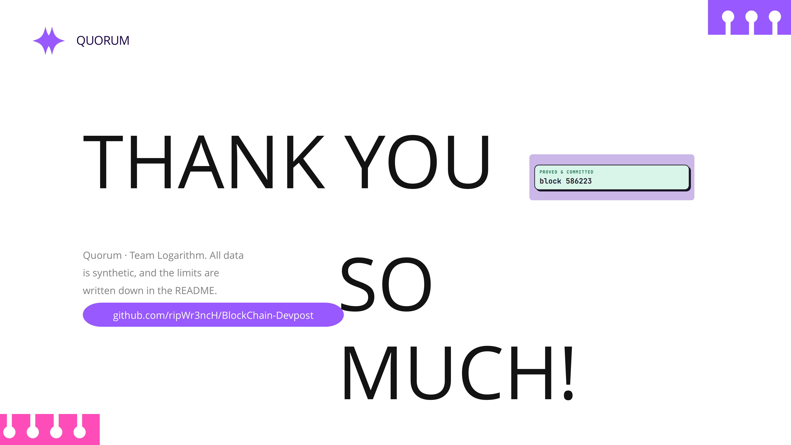

</div>
