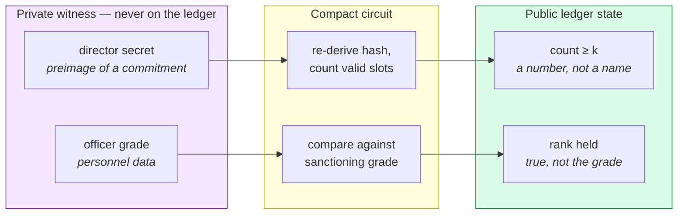
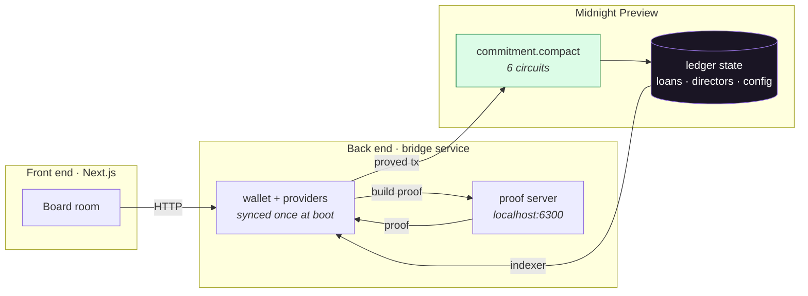
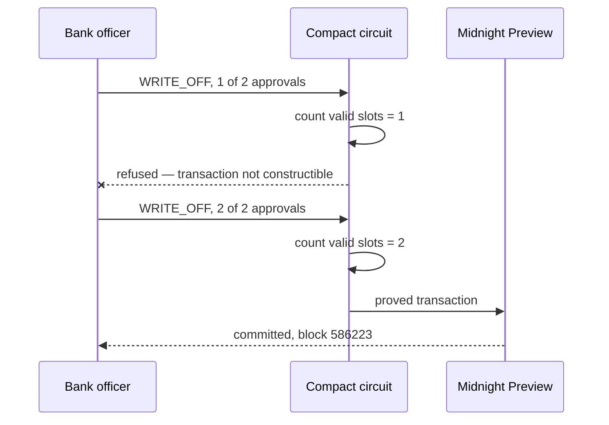

# QUORUM
## A board vote that proves itself
### Supervisory infrastructure for bank loan classification, built on Midnight

**Brainwave 2026 — Midnight Track · Team Logarithm**

---

## Team

| Member | Responsibility |
|---|---|
| **Oitijya Islam Auvro** | Contract design, zero-knowledge circuits, wallet and provider layer |
| **Md. Nafiz Ahmed** | Bridge service, deployment to Midnight Preview, end-to-end verification |
| **Dewan Salman Rahman Zisan** | Front end, banking-regulation research, documentation |

**Repository** — <https://github.com/ripWr3ncH/BlockChain-Devpost> · **Contract (Midnight Preview)** — `08b5b8b1bb403524b1066615752512019714a64859f77bea868f8615fe0f51da`

---

## Abstract

Large corporate groups and politically connected borrowers take substantial bank loans and do not repay
them. The loss is then concealed rather than recognised: instead of classifying the exposure, the bank
grants a new repayment deadline, repeatedly, or writes the loan off. The book reports as performing,
provisions stay small, and no loss is booked until the loss is public.

The rules against this already exist. Classification must be justified in writing over two named
signatures; rescheduling is capped and escalates to the board; a write-off needs board authorisation [5][6].
What is missing is the *record*. It is held by the institution being examined, it can be revised
afterwards, and it is read when an inspection team is physically present. An Asset Quality Review of six
banks assessed Tk 147,595 crore of non-performing loans against Tk 35,044 crore reported — about 4.2
times [2]. That method works, and it reaches six banks at a time [3].

The obvious remedy — commit the approvals to a blockchain — fails for a commercial reason. Proving board
authorisation by publishing every director's signature hands a competitor the bank's governance record.
Institutions decline, reasonably.

**Quorum's claim is that this is a false choice.** A supervisor needs to know that *enough of the right
people approved*. It does not need to know *which ones*. Quorum enforces a regulator's authority rules
inside a Compact smart contract on Midnight, and proves two of them in zero knowledge: a *k*-of-*n* board
threshold over private director approval secrets, and a seniority comparison over a private officer
grade. Only the verified count and the boolean result reach the ledger. The contract is deployed on
Midnight Preview and both rules are verified against it end to end.

**Keywords** — Midnight, Compact, zero-knowledge proofs, loan classification, board authorisation,
supervisory technology

---

# 1. The problem

## 1.1 What actually gets hidden

A loan goes bad. The bank has three ways to keep it out of the classified column:

1. **Reschedule it.** A rescheduling moves an exposure back above the classification line immediately.
   The IMF states the defect in one sentence: *"BB regulations allow immediate reclassification of
   restructured exposures, masking underlying asset quality"* [1].
2. **Upgrade it qualitatively.** Move it out of a classified tier on judgment rather than on days past
   due.
3. **Write it off.** Remove it from the reported non-performing total altogether.

Each is legitimate in some circumstances, which is why each carries an authority requirement rather than
a prohibition. The system that results is not one of absent rules but of rules whose evidence nobody can
check between inspections.

## 1.2 The rules are not what is missing

Bangladesh Bank already requires that every classification be justified in writing over the signatures
of both the assigning and the reviewing officer, maintained in the loan file and available to inspection
teams [5, para 11(c)]. Rescheduling requires approval at least one level above the sanctioning authority,
with board approval at the third and fourth attempt and a cap at three occasions [6]. Qualitative
upgrades out of Sub-Standard are reserved to the board [5, para 6(d)].

These are specific, sensible rules. Three properties defeat them:

- **The evidence is self-custodied.** The signatures sit in a file the examined institution controls.
- **It is revisable.** Nothing preserves what the record said before it was amended.
- **It is read once.** An Asset Quality Review costs 120 calendar days per bank and international audit
  firms [3]. Bangladesh's gross non-performing loan ratio is the second highest in the world after
  war-affected Ukraine [4], and the review programme reaches banks a handful at a time.

"Board approved" is, operationally, a field the bank fills in itself.

## 1.3 Why putting it on a public chain fails

The naive fix is to publish the approvals. It does not survive contact with a bank's board, for a reason
that is not dishonest: a bank's governance record is commercially sensitive. Which directors approved
which write-off, and when, is exactly the material a competitor would want. Publishing every director's
signature to prove authorisation existed is a bad trade, and institutions refuse it.

This is the specific point at which Midnight changes the available design space. The question a
supervisor asks — *did enough of the right people approve?* — and the question publication answers —
*who were they and what did they sign?* — are different questions. Only the second requires anyone to
publish anything.

---

# 2. What Quorum is

## 2.1 The claim

Quorum is a Compact smart contract, a bridge service and a web front end. The contract holds a loan's
append-only event chain and a registry of directors, and it refuses any lifecycle event whose authority
evidence does not satisfy the rule for that event type. Two of those rules are proved in zero knowledge.

**Quorum adds no rule.** It changes where the evidence lives and what has to be true before an event can
be constructed at all. A write-off submitted without sufficient board approval does not fail validation
after the fact — the transaction cannot be built.

## 2.2 Scope

Quorum does not recover money, does not capitalise an institution, and cannot establish that a valuation
is truthful. It can record a falsehood: if the data entering it is manipulated, the contract will commit
that data with valid proofs. What it removes is the ability to assert an authority that was never
obtained, and the ability to revise the record afterwards without leaving a trace.

All data in the deployed demonstration is synthetic. No real borrower, depositor or institution appears
anywhere, and institution names are placeholders.

---

# 3. Design

## 3.1 Roles and the director registry

Identity is an on-ledger role registry rather than a platform-level membership service. Four roles exist:
`BANK_A`, `BANK_B`, `CENTRAL_AUTHORITY` and `REGULATORY_COUNCIL`.

A director is registered by their own bank as a **commitment to a secret, not the secret**:

```
publicKeyCommitment = persistentHash([secret])
```

Registration alone confers nothing. Only the Central Authority may *confirm* a director
(`role == CENTRAL_AUTHORITY`), and the contract refuses a bank that attempts to confirm its own. This
separation is the structural point: a bank that could seat its own board could authorise its own
write-offs.

Revocation is available to the Central Authority or the bank. A revoked director's slot stops counting
immediately, while events already committed remain valid.

## 3.2 The append-only event chain

`originateLoan` opens a chain keyed on a commitment identifier. Every later event carries the previous
state's hash, and the contract asserts it matches:

```
assert(loan.prevStateHash == prevHash, "state divergence: append-only chain broken")
```

A record cannot therefore be quietly rewritten behind the supervisor: an amendment is itself an event,
in sequence, with its own authority requirement.

Eleven event types are modelled — `ORIGINATION`, `RESCHEDULE`, `RESTRUCTURE`, `RECLASSIFY_UP`,
`RECLASSIFY_DOWN`, `WRITE_OFF`, `RECOVERY`, `COLLATERAL_REVALUATION`, `ASSET_PLEDGE`, `LC_DEVOLVEMENT`
and `CORRECTION`. Classification tiers run `STANDARD`, `SMA`, `SUB_STANDARD`, `DOUBTFUL`, `BAD_LOSS`.

Thresholds are not compiled in. A `RegulatoryConfig` struct holds `rescheduleCapOccasions`,
`boardEscalationFromAttempt`, `boardThresholdK` and `councilQuorum` as ledger state, changeable by a
Regulatory Council member without redeploying. The bank cannot touch it.

## 3.3 The board-threshold circuit

This is the heart of the project.

To approve an event, a director supplies their secret as a **private witness**. Inside the circuit,
Quorum:

1. re-derives `persistentHash([secret])` and compares it against the registered commitment;
2. counts the slot only if that director is confirmed and not revoked;
3. rejects duplicates pairwise, so one director cannot fill several slots to reach the threshold alone;
4. discloses **only the resulting count**.

```
const validCount = ((g0 ? 1 : 0) + (g1 ? 1 : 0) + (g2 ? 1 : 0) + (g3 ? 1 : 0)) as Uint<8>;
assert(disclose(validCount) >= config.boardThresholdK,
       "board authorisation required: insufficient confirmed director signatures")
```

A verifier learns *"enough directors approved."* Nothing else crosses the boundary. The current
implementation carries four board slots (`Vector<4, ...>`).

Compact's `disclose()` analysis is what makes this checkable rather than conventional: a witness value
becomes public ledger state only when explicitly wrapped, and the compiler rejects the contract
otherwise. The privacy boundary is enforced at compile time, not by discipline.

## 3.4 The seniority rule

Not every event needs the board. A restructure needs *rank*: it must be authorised at least one grade
above the officer who sanctioned the loan, so that nobody clears their own decision.

That comparison happens inside the circuit over a **private** grade (`witness callerSeniority()`), and
only the boolean result is disclosed:

```
const actingGrade = callerSeniority();
assert(disclose(actingGrade > sanctioningSeniority),
       "authority required: this event must be authorised at least one grade
        above the sanctioning officer")
```

The reason for privacy differs from the board rule, and that is the point. An officer's grade is
personnel data; publishing it on every reclassification would leak the institution's internal hierarchy
to anyone reading the chain. The loan's *sanctioning* grade is public, because it is the bar a later
event must clear and a bar nobody can read is not a bar.

**Two rules, two different privacy shapes** — a count over a set, and a single comparison. One
zero-knowledge rule can look like a party trick; two show the pattern generalises.

## 3.5 The decision table

`appendEvent` derives the required authority from the event itself:

| Event | Required authority |
|---|---|
| `WRITE_OFF` | Board threshold (*k*-of-*n*, ZK) |
| `RESCHEDULE`, attempt ≥ `boardEscalationFromAttempt` | Board threshold (*k*-of-*n*, ZK) |
| `RESCHEDULE`, earlier attempts | One level above sanctioning officer (ZK) |
| `RECLASSIFY_UP` out of a classified tier | Board threshold (*k*-of-*n*, ZK) |
| `RECLASSIFY_UP` otherwise | One level above sanctioning officer (ZK) |
| `RESTRUCTURE`, `COLLATERAL_REVALUATION`, `ASSET_PLEDGE` | One level above sanctioning officer (ZK) |
| `CORRECTION` | MD/CEO role |
| `RECLASSIFY_DOWN`, `RECOVERY`, `LC_DEVOLVEMENT` | Mechanical — arithmetic only |

The rescheduling cap is enforced separately: `assert(rsSeq <= config.rescheduleCapOccasions, "reschedule cap exceeded")`.

## 3.6 The privacy boundary



*Figure 1 — What crosses into public ledger state. Everything on the left is a witness the circuit reads
and never publishes; everything on the right is the whole of what a verifier learns.*

---

# 4. Implementation

## 4.1 Architecture



*Figure 2 — Deployed architecture. The bridge is a separate long-lived process for a structural reason,
not a stylistic one (§4.3).*

## 4.2 The contract

`commitment.compact` exports six circuits.

| Circuit | Authority required |
|---|---|
| `originateLoan` | a bank (`BANK_A` / `BANK_B`) |
| `appendEvent` | the institution owning the loan, plus the event's own rule (§3.5) |
| `registerDirector` | the bank itself — `role == institution` |
| `confirmDirector` | Central Authority only |
| `revokeDirector` | Central Authority or the bank |
| `setRegulatoryConfig` | a Regulatory Council member |

A genesis constructor seeds `config`, `councilMembers` and `centralAuthority`. Without it every ledger
field starts at its zero value and the failure is silent rather than loud: `boardThresholdK` would be 0,
`validCount >= 0` would be trivially true, and the board threshold could refuse nothing while appearing
to work.

## 4.3 The bridge

A Midnight wallet must replay ledger history before it can sign anything, which takes minutes. It cannot
be constructed per request. The bridge therefore syncs once at boot, caches its synced state to disk, and
then serves circuit calls over HTTP. It holds the funded wallet, so it cannot live in a browser.

## 4.4 Deployment

The contract is deployed on **Midnight Preview** at
`08b5b8b1bb403524b1066615752512019714a64859f77bea868f8615fe0f51da`, confirmed through the Preview indexer
rather than only through our own bridge. The toolchain is Compact 0.31.1 and proof server 8.1.0 [7][8].

## 4.5 Verification

`scripts/midnight-smoke.mjs` drives the whole story over HTTP and **fails loudly if a write-off commits
without board approval**. A run in which that succeeds is a failure even though nothing threw — it would
mean the threshold is not being enforced, which is the entire claim.

```
4. Attempt WRITE_OFF with 0 of 2 approvals (must be refused)
   refused        board authorisation required: insufficient confirmed director signatures

5. Resubmit with 2 approvals (must commit)
   committed      001f5b2ea0ec4ed2e7bd90c6addbe0384e797ba127356e9b3154b50bf9779d690b
   block          586223

6. RESTRUCTURE at the sanctioning grade (must be refused)
   refused        authority required: this event must be authorised at least one grade
                  above the sanctioning officer

7. Resubmit one grade above (must commit)
   committed      002299262b44783ed8d04097807148e67175d5e6cc7a1fe19135493cc26660d283
   block          586236

PASSED
```



*Figure 3 — The same submission, refused and then committed. The refusal is produced by the proof
failing, not by a front-end check.*

---

# 5. Engineering findings

Four problems in this build were expensive enough to be worth recording.

## 5.1 Wallet sync throughput

A first-time sync replays every ledger event. The SDK's default batching walked the shielded stream at
**~80 events/s** — roughly five hours — and exhausted a 6 GB heap before finishing. The shielded wallet's
configuration accepts a `batchSize`; at 5,000 the same scan runs at **~14,000 events/s with resident
memory flat near 340 MB**. That single number is the difference between "cannot sync at all" and "syncs
in two minutes."

## 5.2 Preview versus PreProd

The DUST wallet's batch size is **hardcoded at 10 events per tick** inside the SDK, so it cannot be tuned
and runs at 60–280 events/s regardless.

| Network | Stream length | First sync |
|---|---|---|
| Preview | ~151,000 events | tens of minutes — workable |
| PreProd | ~1,453,000 events | over nine hours, and it exhausts memory first |

Preview is therefore the default. The competition rules accept either.

## 5.3 Duplicate WASM instances

Two installs of `@midnight-ntwrk/onchain-runtime-v3` — even at the *same version* — mean two WASM
instantiations, and `instanceof` fails across them. The symptom is a bare `expected instance of
StateValue` from deep inside a transaction merge. It needs one *hoisted* copy, not merely one version.

## 5.4 Windows file URLs

`new URL(import.meta.url).pathname` keeps a leading slash on Windows, so `path.resolve` produces
`G:\G:\…`. Everything derived from it silently pointed at a directory that does not exist, and the deploy
failed *after* half an hour of syncing, with an error about a missing verifier key that was sitting on
disk. Use `fileURLToPath`. A `preflight()` check now catches this class of bug in two seconds.

---

# 6. What is built, and what is not

## 6.1 Built and verified against the live contract

- `commitment.compact` — six circuits, a real *k*-of-*n* board threshold proved in zero knowledge, and a
  seniority rule proved over a private grade.
- Wallet, provider and deploy layer, with state caching so restarts take seconds.
- Bridge service and Next.js board room, exercised end to end by the smoke test.

## 6.2 Limits we do not paper over

1. **Board approvals are replayable across events.** An approval proves knowledge of the preimage of a
   registered commitment. It is *not* a signature over the event, so a bank that has collected a
   director's secret once could reuse it for a later vote without asking again. Binding an approval to a
   specific event needs a per-event registration step this registry does not model.
2. **Director identities are still disclosed.** Looking a director up in a public ledger `Map` requires a
   public key. What the zero-knowledge layer buys here is **credential secrecy, not voter anonymity**.
3. **`callerRole` is asserted by the bridge.** That is acceptable for a prototype in which one operator
   drives every party, but it is **not a security boundary**; production would derive the role from the
   caller's own key.
4. **Only the `commitment` module exists.** Two further modules were designed and are not built here:
   cross-bank encrypted exposure aggregation, and depositor claim tokens. They are described in §8 as
   future work, not as delivered features.
5. **It can record a falsehood.** If the core banking data is manipulated upstream, Quorum commits it with
   valid proofs. The defence is attribution and reconciliation, and neither prevents coordinated internal
   falsification.

---

# 7. From Fabric to Midnight

A predecessor of this project ran on Hyperledger Fabric [9]. Porting to Midnight was not a change of
hosting; it changed what the contract can honestly claim.

| | Fabric version | Midnight version |
|---|---|---|
| **Board approval evidence** | every director signature submitted **in cleartext** as a transaction argument | approval secrets are a **private witness**; only the count that verified is disclosed |
| **Seniority evidence** | acting grade submitted in cleartext | grade is a private witness; only the comparison is disclosed |
| **Regulatory thresholds** | hardcoded, with jurisdiction-specific citations | `RegulatoryConfig` ledger struct, Council-governed, changeable without redeploying |
| **Who may confirm a director** | MSP identity | on-ledger role registry; a bank still cannot constitute its own board |
| **Privacy enforcement** | convention and code review | `disclose()` analysis, checked by the compiler |

The Fabric implementation is removed from the working tree and survives in git history at commit
`79eeef7` for anyone who wants to compare the two approaches.

---

# 8. Roadmap

| | Scope | Depends on |
|---|---|---|
| **Now** | Six circuits on Preview; board threshold and seniority proved in ZK; bridge and board room | delivered |
| **Next** | Bind approvals to a specific event hash, closing limit §6.2(1); derive `callerRole` from the caller's key, closing §6.2(3) | contract work only |
| **Then** | Cross-institution exposure aggregation under encryption — a borrower group's system-wide total without any bank exposing its book | more than one participating institution |
| **Later** | Depositor claim tokens bound to signed balance leaves | resolution-law authorisation |

The first two rows need no other participant. That sequencing is deliberate: a supervisory network that
must be complete before it is useful is a network that never starts.

---

# 9. Conclusion

The losses were not undetectable — an Asset Quality Review found roughly four times the non-performing
loans six banks had reported [2]. Nor were the rules absent: classification already needs two named
signatures, rescheduling is already capped, and a write-off already needs the board [5][6].

What was missing was a record anyone could check between inspections, and the only obvious way to build
one asked banks to publish their governance in exchange. Quorum declines that trade. A regulator's rule
runs inside a Compact contract; the credentials that satisfy it stay in a private witness; and the ledger
learns a count and a boolean.

It does not make bankers honest. It makes dishonesty something that has to be committed deliberately, in
a record its author cannot afterwards quietly revise, against a rule the code checks before the
transaction can exist at all.

---

# References

1. International Monetary Fund, *Bangladesh: 2025 Article IV Consultation — Press Release; Staff Report;
   and Statement by the Executive Director for Bangladesh*, IMF Country Report No. 26/24, 30 January 2026.
   <https://www.imf.org/en/publications/cr/issues/2026/01/30/bangladesh-2025-article-iv-consultation-press-release-staff-report-and-statement-by-the-573579>
2. The Daily Star, *Audits expose hidden bad loans at 6 Islamic banks*, 20 July 2025.
   <https://www.thedailystar.net/business/banking/news/audits-expose-hidden-bad-loans-6-islamic-banks-3944166>
3. The Business Standard, *11 troubled banks to face asset quality test by int'l firms from January*, 2026.
   <https://www.tbsnews.net/economy/banking/11-troubled-banks-face-asset-quality-test-intl-firms-january-1508636>
4. The Business Standard, *Bangladesh has world's second-highest NPL rate after war-hit Ukraine*, 2026.
   <https://www.tbsnews.net/economy/banking/bangladesh-has-worlds-second-highest-npl-rate-after-war-hit-ukraine-1482606>
5. Bangladesh Bank, *BRPD Circular No. 15, 27 November 2024 — Master Circular: Loan Classification and
   Provisioning*, effective 1 April 2025.
   <https://www.bb.org.bd/mediaroom/circulars/brpd/nov272024brpd15e.pdf>
6. Bangladesh Bank, *Prudential Regulation for Banks: Selected Issues*, April 2024, "Loan Rescheduling and
   Restructuring", pp. 114–117. <https://www.bb.org.bd/aboutus/regulationguideline/prudregapr2024.pdf>
7. Midnight Network, *Developer documentation*. <https://docs.midnight.network/>
8. Midnight Network, *Compact compiler and language toolchain*.
   <https://github.com/midnightntwrk/compact>
9. Hyperledger Fabric, *The Ordering Service*.
   <https://hyperledger-fabric.readthedocs.io/en/latest/orderer/ordering_service.html>
10. Team Logarithm, *Quorum — source repository*.
    <https://github.com/ripWr3ncH/BlockChain-Devpost>
